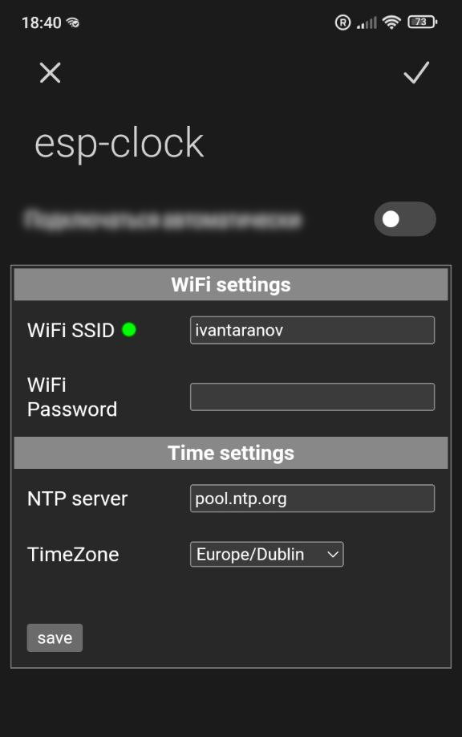
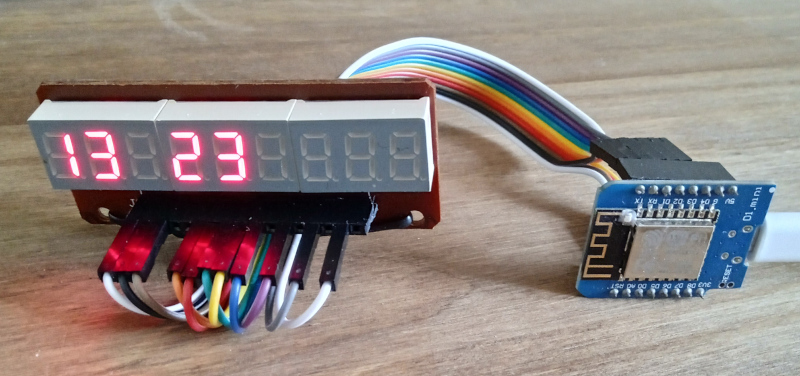

# ESP-Clock

This is a ESP8266 based watch. The watch receives time from the NTP server. Timezones is supported. For configuration, an AP mode with a captive portal technique is provided. After successfully connect to WiFi network, AP mode is off after 5 minutes.

## v0
First version. The watch has a 7-segment LED display.

Watch [schematic](res/sch-v0/sch-v0.pdf)
