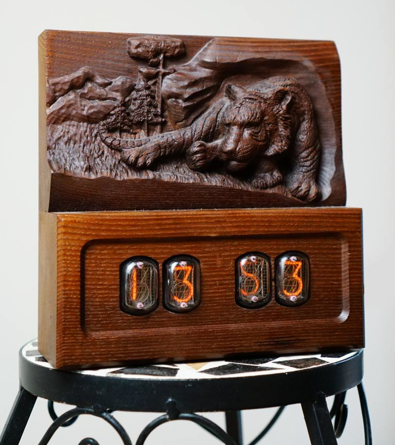
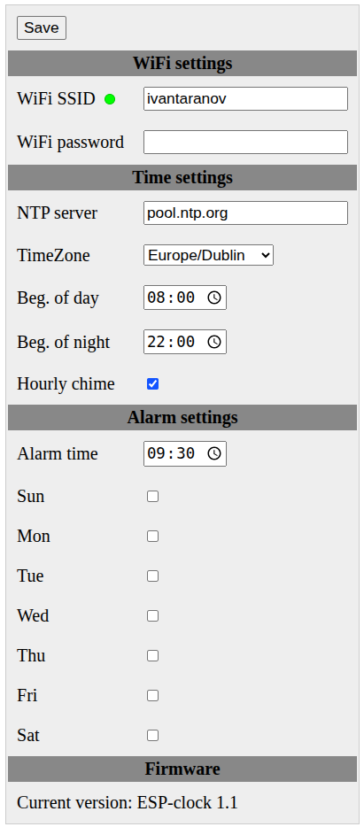

# ESP-Clock

Meet our ESP8266-powered Nixie tube clock — a perfect blend of vintage charm and modern technology. It automatically synchronizes the time via an NTP server and supports multiple time zones, so it’s always accurate wherever you are. Setup is quick and simple thanks to a built-in AP mode with a captive portal. The warm glow of genuine Nixie tubes displays the time in style, while an integrated alarm and hourly chime add both function and nostalgia. A built-in battery-backed real-time clock keeps precise time even without power or Wi-Fi. Housed in a handcrafted wooden case, it’s as beautiful as it is precise.

## schematic
main block [schematic](res/ESPClock-main.pdf)

nixie tube block [schematic](res/ESPClock-nixie.pdf)

##

